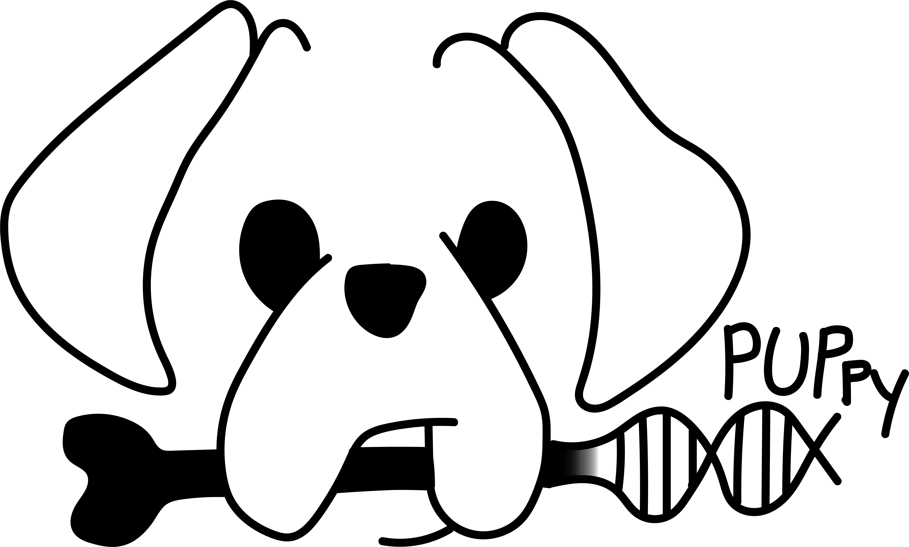

# Phylogenetically Unique Primers in python (PUPpy)

PUPpy is a fully automated computational pipeline to design taxon-specific primers, which can be used to detect microbes and quantify substrain-level absolute microbial counts

**PUPpy is hosted in the Tropini Lab GitHub page.** See here: [PUPpy](https://github.com/Tropini-lab/PUPpy)
